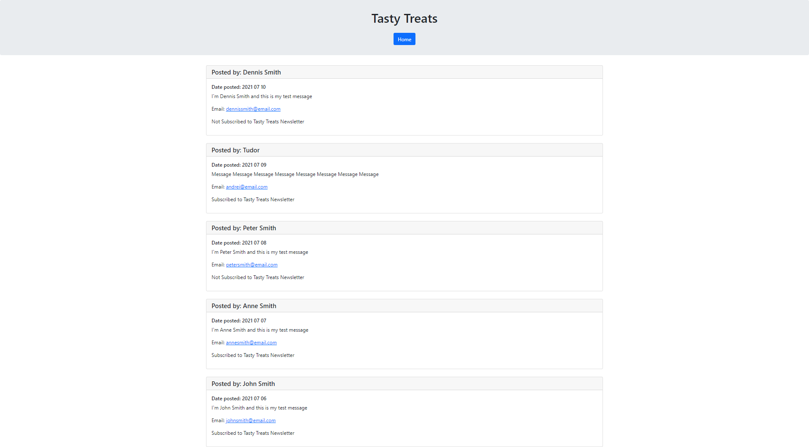

# Tasty Treats

## Table of Contents

- [Tasty Treats](#tasty-treats)
  - [Table of Contents](#table-of-contents)
  - [Description](#description)
  - [User STory](#user-story)
  - [Getting Started](#getting-started)
  - [Screenshots](#screenshots)
  - [Link to Github](#link-to-github)

## Description

Tasty Treats app is an inquiry form that allows for messages to be submitted by users and saved in the database. Messages can also be viewed by accessing the View Messages page.

## User STory

```md
WHEN I open the Application, I am presented with the landing page and two buttons that let me choose whether I want to add a message or view messages.

WHEN I click on "Leave us a message" button
THEN I am redirected to the Leave A Message page.

WHEN I add my details, message, check if I want to subscribe to the newsletter and click "Submit"
THEN I my message is saved and I am redirected to the "View Messages" page.

WHEN I do not complete all of the required fields,
THEN an error will be displayed letting me know that i need to complete all of the required fields.

WHEN a bot tries to submit the form, two hidden input fields would register different values than expected,
THEN the form will not be submitted and an error message would be rendered on the page.

WHEN I try to submit the message without a valid email,
THEN an error will be thrown, informing me that I need to submit a valid email address.

WHEN I am redirected to the View messages page, I can see all of the messages that have been sent, the name, email address of the user that sent the message, the date the message was sent and whether the user is subscribed to the newsletter or not. Newest messages being displayed at the top.

WHEN I click on the "Home" button,
THEN I am redirected back to the lading page.
```

## Getting Started

- open the terminal and cd into your desired folder

- run `git clone git@github.com:ttudorandrei/tasty-treats.git`

- type in `code .` to open the app in vscode

- in your VSCode terminal type in `npm run seed` to seed the database

- after you seed the db, you can run `npm run start` to run the server

- open the link displayed in your terminal

## Screenshots

Homepage


Leave a Message


View Messages


## Link to Github

You can view the repository for this application by clicking [here](https://github.com/ttudorandrei/tasty-treats)
